# Kozbeyli Konağı — Repo Audit (Graphify Edition)

> Principal-level teknik denetim · Analiz amaçlı, **kod değiştirilmedi**.
> Tarih: 2026-06-10 · Commit: `ad0521a` · Denetlenen: `src/` (≈13.8k satır TS/TSX), `payload/`, `tests/`, config.
> Her bulgu kanıta dayalıdır (file:line). Doğrulanamayanlar açıkça belirtilmiştir.

---

## 1. Executive Summary

**Genel Sağlık Notu: B− (Olgunlaşmakta olan, iyi mühendislik refleksleri olan bir üretim-öncesi pazarlama/dönüşüm sitesi).**

Bu, tek bir butik otel için yapılmış, dönüşüm odaklı bir Next.js 15 + Payload CMS 3 sitesi. Güvenlik temelleri beklenenin üzerinde: Zod doğrulama, CSRF (same-origin), rate limit, ES256 webhook imzası, Turnstile ve fail-closed origin kontrolü tutarlı şekilde uygulanmış. Notu B'nin altına çeken şey güvenlik açığı değil; **`/odeme` akışındaki sahte (mock) ödeme onayı** ve **kimlik doğrulamasız `/admin/growth` paneli** gibi yanlış güven veren yüzeyler, bir avuç **god-file** (822 + 667 + 569 satır), ve **sıfır CI** ile **in-memory rate-limit/replay store**'un serverless'ta etkisizleşmesi. Proje hızlı bir "growth engine" anlatısıyla büyütülmüş; bu yüzden gerçek olanla simüle olanın (swarm, growth dashboard, mock pricing) sınırı bulanık.

**En büyük 3 risk:** (R1) `/odeme` "Ödeme onaylandı" diyor ama hiçbir tahsilat yok — `4` ile başlayan her kart kabul ediliyor (`checkout/route.ts:79`); kullanıcı ödediğini sanır. (R2) `/admin/growth` herkese açık, auth yok (`app/admin/growth/page.tsx:1`). (R3) Rate-limit ve webhook replay koruması `Map` tabanlı (`lib/security.ts:6`), Vercel'de her lambda izole olduğundan koruma fiilen delik.

**En büyük 3 fırsat:** (O1) CI gate (build+lint+test) — 14/14 e2e + 10/10 unit zaten var, sadece otomasyona bağlanmamış. (O2) Üç god-file'ı bölmek tüm gelecek işi hızlandırır. (O3) Kullanılmayan ağır bağımlılıkları (Remotion ~3 paket, graphql) kaldırmak / netleştirmek.

> D5 (Findings by Severity) ve D6 (Risk Matrix) hemen aşağıda — hızlı triyaj için.

### D5 — Findings by Severity

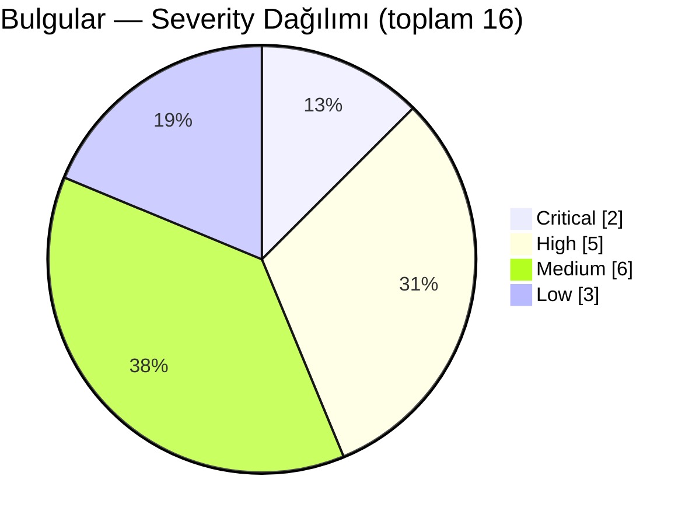
*Ne gösterir: 16 bulgunun severity dağılımı. Dikkat: yalnızca 2 Critical var ve ikisi de "yanlış güven veren yüzey" (mock ödeme + korumasız admin) — kod kalitesinden çok ürün-güvenlik sınırı sorunu.*

### D6 — Risk Matrix (fix-first = sağ üst)

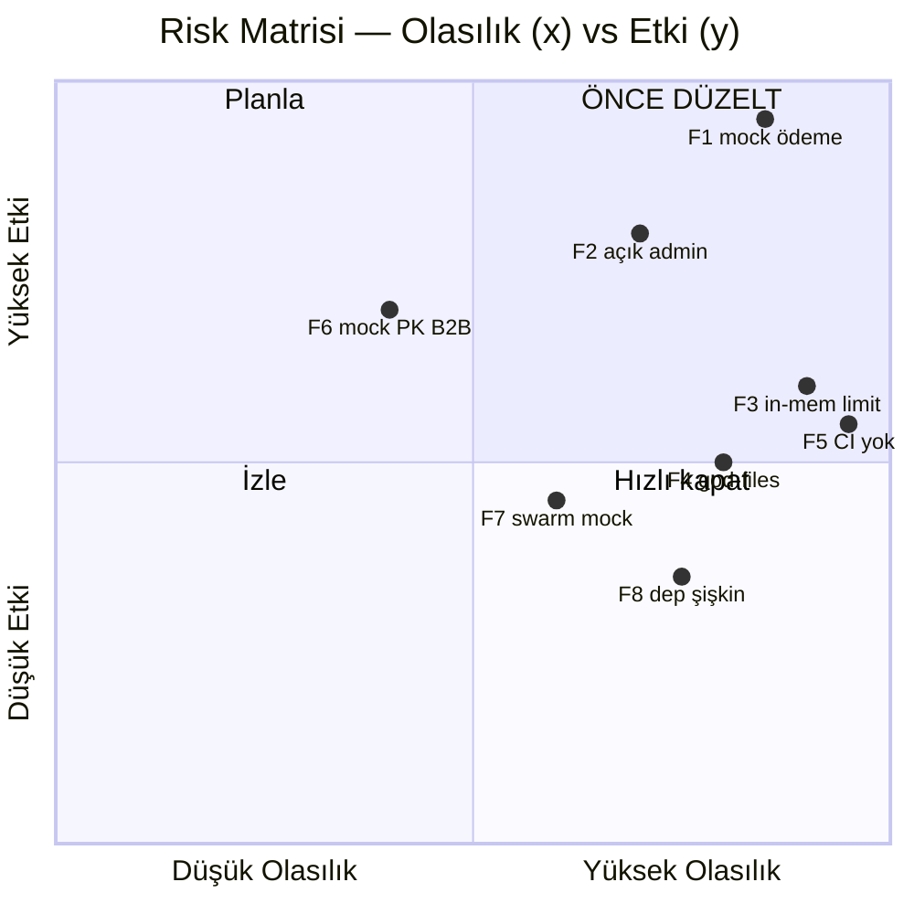
*Ne gösterir: bulguların olasılık×etki konumu. Dikkat: F1/F2 sağ-üstte ("önce düzelt"); F3 ve F5 yüksek olasılıklı çünkü her deploy'da geçerli.*

---

## 2. Repo Map

**Amaç:** Kozbeyli Konağı taş otel & restoranın resmi sitesi — rezervasyon dönüşümü ve marka otoritesi odaklı (`README.md:3`). Hedef kitle: romantik çift, sessiz lüks arayan aileler, etkinlik planlayanlar (`.claude/CLAUDE.md`).

**Stack (doğrulandı `package.json`):** Next.js 15.4.11 (App Router, React 19) · Payload CMS 3 (Postgres adapter) · Tailwind v4 · Framer Motion 12 · Zod · PostHog · Vitest + Playwright + Storybook · Hedef: Vercel (`railway.json` da var — ikili sinyal).

**Olgunluk:** Üretim-öncesi. Gerçek dönüşüm akışı + CMS şeması olgun; ama ödeme mock, bir kısım "AI growth" yüzeyi simülasyon, CI yok.

### D1 — Architecture Graph

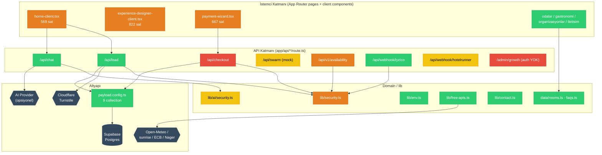
*Ne gösterir: katmanlı modül grafiği + gerçek import/çağrı kenarları. Dikkat: `/api/checkout` ve `/admin/growth` kırmızı (Critical) — biri sahte ödeme onaylıyor, diğeri auth'suz; üç dev client component (turuncu) tüm sayfa mantığını tek dosyada topluyor. Evidence: `payload.config.ts`, `src/app/api/*/route.ts`, `src/lib/*`, `src/components/*-client.tsx`.*

### D2 — Primary Data Flow (rezervasyon → checkout)

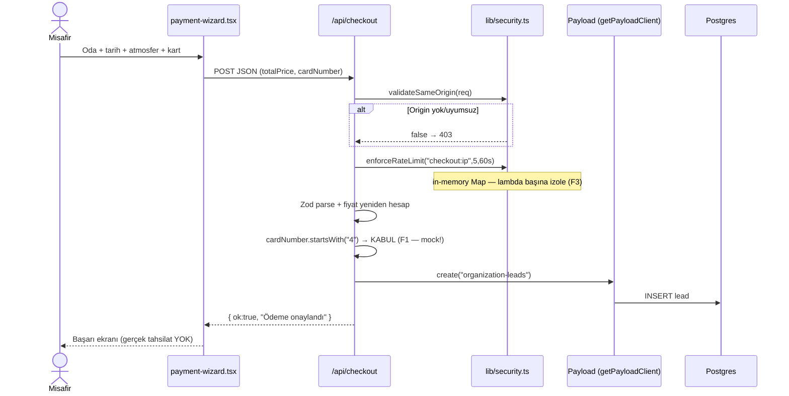
*Ne gösterir: en kritik runtime yolu uçtan uca. Dikkat: güvenlik adımları (origin, rate-limit, fiyat-doğrulama) sağlam ama son onay sahte — kullanıcıya "ödeme onaylandı" denip kart çekilmiyor (F1). Evidence: `src/app/api/checkout/route.ts:28-138`, `src/lib/security.ts:34-80`.*

### D3 — Repo Topology

```
src/
├─ app/                    # Next.js App Router — sayfalar + API route'lar
│  ├─ api/                 # 9 route: lead, checkout, chat, swarm(mock), v1/availability, webhook/*
│  ├─ admin/growth/        # ⚠ auth'suz "growth dashboard" (F2)
│  ├─ (payload)/admin/     # Payload CMS paneli (generated importMap)
│  └─ <14 sayfa>/          # odalar, gastronomi, rezervasyon, iletisim, hikayemiz...
├─ components/             # 38 client component — 3 god-file burada (F4)
├─ lib/                    # security, env, ai/, free-apis, contact, schema, growth-engine
│  ├─ agents/              # ad-optimizer (Remotion'a bağlı)
│  └─ ai/                  # provider + security
├─ data/                   # rooms.ts, faqs.ts (statik içerik kaynağı)
├─ remotion/               # ⚠ video render — siteye bağlı değil, ayrı build (dead-ish, F8)
├─ services/               # booking, ai, lead yardımcıları
└─ middleware.ts           # 34 sat — sadece simüle geo-log, no-op rewrite
payload/collections/       # 9 collection — HotelRunnerEvents.ts ARTIK ÖLÜ (F7)
tests/                     # 12 dosya — monkey.spec + monkey-test.spec DUPLİKE
agent/, brand/, scratch/   # vendor/çalışma alanı (scratch .gitignore'da)
```
*Generated: `payload-types.ts` (506 sat), `app/(payload)/admin/importMap.js`. Ölü/şüpheli: `payload/collections/HotelRunnerEvents.ts` (HotelRunner kaldırıldı), `src/remotion/*` (siteden import edilmiyor).*

**Şaşırtanlar:** (1) `railway.json` + Vercel hedefi birlikte — deploy hikayesi belirsiz. (2) `lib/security.ts` (gerçek, sağlam) ile `app/api/swarm` (tamamen mock cevaplar) aynı repoda yan yana. (3) `/admin/growth` "DA_VINCI / HOPPER / VON_NEUMANN" gibi sahte ajan node'larıyla dolu bir dashboard ama korumasız.

---

## 3. Audit Report

Önce **güçlü yönler** (korunacaklar), sonra severity sırasıyla bulgular.

### Strengths (preserve)
- **Tutarlı girdi doğrulama:** Tüm yazma route'larında Zod şeması (`lead/route.ts:14`, `checkout/route.ts:8`). *Fact.*
- **CSRF + fail-closed origin:** `validateSameOrigin` Origin yoksa reddediyor (`lib/security.ts:34-47`). *Fact.*
- **Gerçek kripto webhook imzası:** WebCrypto ES256, bağımlılıksız, hata fırlatmıyor (`lib/security.ts` `verifyEs256Signature`); 5/5 unit test (`tests/security-es256.test.ts`). *Fact.*
- **Fiyat sunucuda yeniden hesaplanıyor** (client tamper koruması) (`checkout/route.ts:60-73`). *Fact.*
- **Honeypot + Turnstile** lead formunda (`lead/route.ts:36,117`). *Fact.*
- **Ücretsiz API'lerde fetch cache** (`free-apis.ts:20-23`, 30dk–24s revalidate). *Fact.*
- **Test üçlüsü mevcut:** unit 10/10 + e2e 14/14 + CSP regresyon nöbetçisi (`tests/e2e/site-smoke.spec.ts:17-28`). *Fact.*

### Findings

| ID | Boyut | Bulgu (file:line) | Neden önemli | Sev | Tip |
|----|-------|-------------------|--------------|-----|-----|
| **F1** | Security/Correctness | Mock ödeme: `4` ile başlayan her kart onaylanıp "Ödeme onaylandı" dönüyor (`api/checkout/route.ts:79,134`) | Kullanıcı ödediğini sanır, tahsilat yok → güven + ciro kaybı, olası tüketici hukuku ihlali | **Critical** | Fact |
| **F2** | Security/Authz | `/admin/growth` client component, hiçbir auth/guard yok (`app/admin/growth/page.tsx:1-20`) | İç metrik/ajan paneli herkese açık; bilgi sızıntısı + yanlış profesyonellik algısı | **Critical** | Fact |
| **F3** | Security/Arch | Rate-limit & replay store in-memory `Map` (`lib/security.ts:6`, `ai/security.ts:8`, `webhook/iyzico:18`) | Vercel'de her invocation izole → limit/replay koruması fiilen geçersiz (DoS/replay) | **High** | Fact |
| **F4** | Code quality | God-file'lar: `experience-designer-client.tsx` 822, `payment-wizard.tsx` 667, `home-client.tsx` 569 sat | Test edilemez, yeniden kullanılamaz, merge çatışması mıknatısı; değişiklik maliyeti üstel | **High** | Fact |
| **F5** | DevEx/Ops | CI yok (`.github/` yok); lint/test/build hiçbir gate'e bağlı değil | Yeşil testler manuel; regresyon ancak elle yakalanır; "yeşil sanılan kırık" riski | **High** | Fact |
| **F6** | Security | B2B availability public key kodda hardcoded "MOCK" (`api/v1/availability/route.ts:5-8`) + yorum "gerçekte DB'den gelir" | Endpoint canlı sanılırsa sahte imzalı erişim; ya tamamla ya kaldır | **High** | Fact |
| **F7** | Arch/Dead code | `swarm/route.ts` tüm cevaplar hardcoded mock; `payload/collections/HotelRunnerEvents.ts` artık ölü (HotelRunner kaldırıldı) | Gerçek-mock sınırı belirsiz; ölü kod bakım yükü + yanlış yönlendirme | **High** | Fact |
| **F8** | Dependencies | Remotion (3 paket, `@remotion/*` + `remotion`) yalnız `src/remotion/*` içinde; site hiç import etmiyor. `graphql` hiç kullanılmıyor (`grep` 0 hit) | ~node_modules şişkinliği, build yüzeyi, güvenlik yüzeyi; gereksizse kaldırılmalı | **Medium** | Fact |
| **F9** | Ops | İki deploy hedefi: `railway.json` + Vercel (README) | Belirsiz deploy hikayesi; env/secret yönetimi ikiye bölünür | **Medium** | Judgment |
| **F10** | Testing | `tests/monkey.spec.ts` ve `tests/monkey-test.spec.ts` neredeyse aynı | Bakım ikiliği; hangisi kaynak belirsiz | **Medium** | Fact |
| **F11** | Code quality | `as any` cast'leri checkout/lead'de (`checkout/route.ts:95,103`) | Payload tip güvenliği deliği; şema değişince sessiz kırılma | **Medium** | Fact |
| **F12** | Observability | Yapılandırılmış log yok; düz `console.log/warn` (`checkout/route.ts:128`, `middleware.ts:20`) | Prod'da arama/alarm zor; PII (IP, isim) log'a sızabilir | **Medium** | Judgment |
| **F13** | Security | Checkout kart numarasını alıyor (`cardNumber` şemada, `:24`) ama PCI kapsamı yok | Gerçek karta geçilirse PCI-DSS yükümlülüğü; şu an ham PAN sunucuya geliyor | **Medium** | Fact |
| **F14** | DevEx | README "copy .env.example" diyor ama tek komutluk seed/bootstrap akışı eksik; ilk admin manuel | Onboarding sürtünmesi (düşük, tek geliştirici) | **Low** | Judgment |
| **F15** | Perf | `middleware.ts` her eşleşen istekte çalışıp no-op `NextResponse.next()` dönüyor (`:25`) | Sıfır faydaya karşılık edge invocation maliyeti; ya işlev kazandır ya kaldır | **Low** | Fact |
| **F16** | Docs | README stack tablosu "Supabase" derken `railway.json` ve mock ödeme dokümante değil | Yeni geliştirici mock ödemeyi gerçek sanabilir | **Low** | Judgment |

### D4 — Coupling & Hotspot Graph

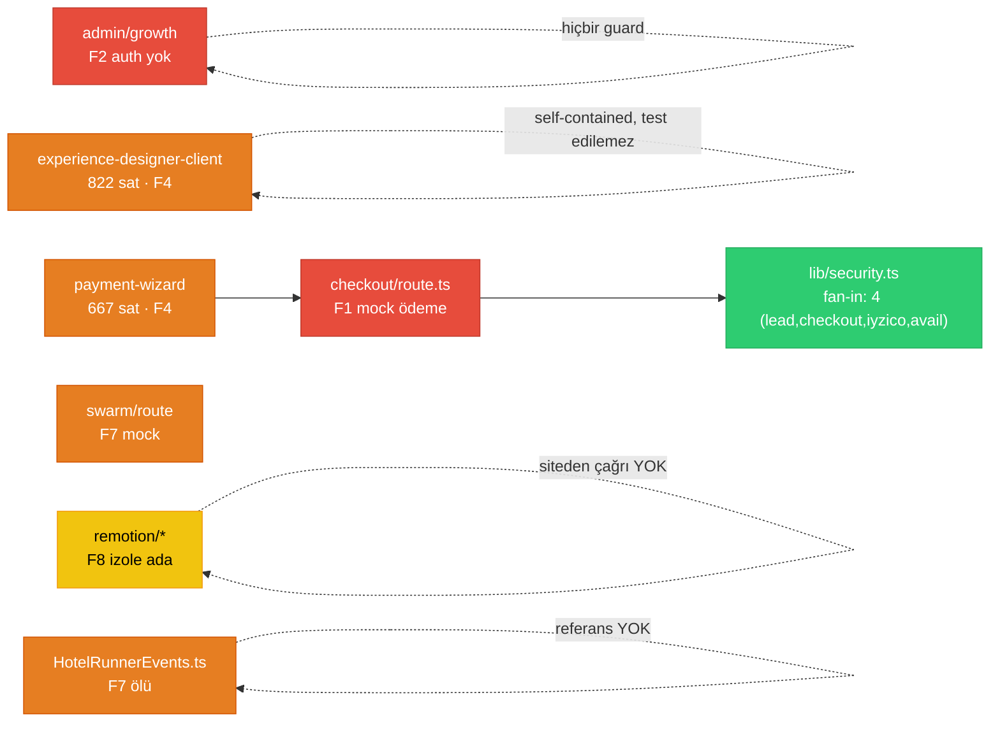
*Ne gösterir: bağ yoğunluğu + hotspot'lar. Dikkat: `lib/security.ts` sağlıklı bir merkez (fan-in 4, iyi); asıl sorun düşük-bağ "izole adalar" — Remotion ve HotelRunnerEvents hiçbir yerden çağrılmıyor (ölü), god-file'lar ise kendi içine kapalı. Evidence: `grep` import taraması; `package.json`.*

### D7 — Security Surface Map

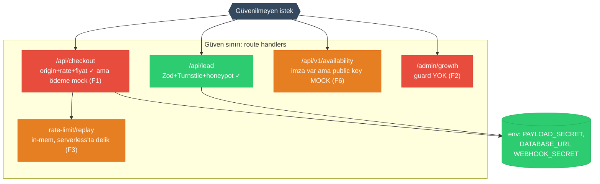
*Ne gösterir: güvenilmeyen girdinin nereden girip nerede doğrulandığı. Dikkat: doğrulama disiplini genelde iyi (yeşil) — kırmızılar kod açığı değil, "tamamlanmamış/yanlış-güven" yüzeyleri: mock ödeme, korumasız admin. Evidence: `api/*/route.ts`, `lib/security.ts`, `lib/env.ts`.*

**Hafif incelenen alanlar:** `src/remotion/*`, `agent/`, `trigger/` (çekirdek dönüşüm yolunun dışında — yüzeysel bakıldı). Derinlik çekirdek %20'ye (api + lib/security + payment-wizard + checkout) verildi.

---

## 4. Improvement Strategy

### Temalar (D8)

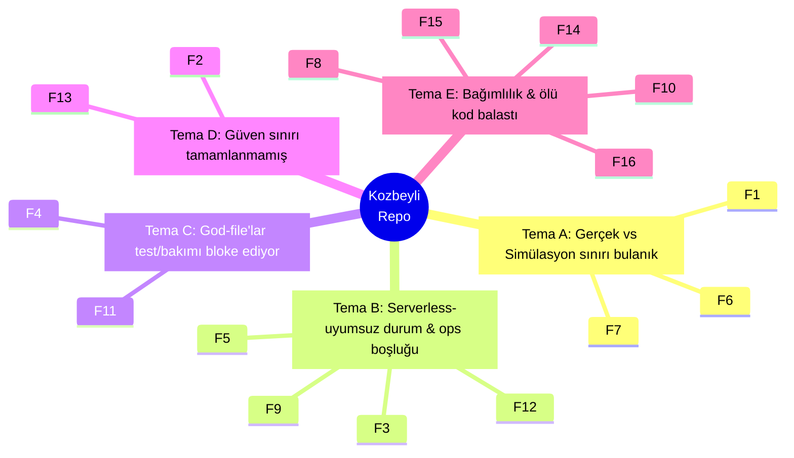
*Ne gösterir: her Critical/High bulgu tam bir temaya bağlı. Dikkat: en yoğun temalar A ve B — bunlar "yarım kalmış üretimleştirme"nin iki yüzü. Evidence: F1–F16 üstteki tablo.*

**Tema A — Gerçek vs Simülasyon (F1, F6, F7):** Hedef durum: simülasyon kodu ya gerçekleştirilir ya açıkça işaretlenip izole edilir (feature flag + UI uyarısı + `/admin` guard). İlke: *"Bir endpoint canlı görünüyorsa canlı davranmalı; değilse kullanıcı/geliştirici bunu net bilmeli."*

**Tema B — Serverless durum & ops (F3, F5, F9, F12):** Hedef: paylaşımlı durum (Upstash/Redis veya Postgres) + CI gate + tek deploy hedefi + yapılandırılmış log. İlke: *"Üretim davranışı, üretim çalışma zamanının kurallarına uymalı (lambda izolasyonu)."*

**Tema C — God-file'lar (F4, F11):** Hedef: 822/667/569 satırlık dosyaları alt-bileşen + hook + saf fonksiyonlara böl; `any` cast'lerini Payload tipleriyle değiştir. İlke: *"Bir dosya tek bir nedenle değişmeli."*

**Tema D — Güven sınırı (F2, F13):** Hedef: `/admin/*` auth zorunlu; ham PAN sunucuya hiç gelmesin (PSP tokenization). İlke: *"Hassas yüzeyler varsayılan kapalı."*

**Tema E — Balast (F8, F10, F14, F15, F16):** Hedef: kullanılmayan bağımlılık/dosya kaldır, duplike test birleştir, README'yi gerçeğe hizala.

### Açık non-goals (düzeltMEyecekler)
- **EN dil rotaları / tam i18n:** Mevcut cookie tabanlı çözüm bu olgunlukta yeterli; tam route-based i18n yüksek efor/düşük acil getiri.
- **Mikroservis/queue altyapısı:** Tek otel sitesi için aşırı mühendislik. `trigger.dev` zaten yeterli.
- **Remotion'u "düzeltmek":** Kullanılmıyorsa kaldır; video pipeline'ı canlandırmak ürün hedefi değil.
- **%100 test coverage:** Çekirdek (checkout, security, lead) %80 hedefi yeterli; pazarlama sayfaları smoke ile kapalı.

### Definition of Done (ölçülebilir)
1. **Zero Critical** (F1, F2 kapalı).
2. CI: `build + lint + vitest + playwright` PR'da zorunlu, kırmızıda merge engelli.
3. Rate-limit/replay paylaşımlı store'da; tek lambda varsayımı yok.
4. Hiçbir route dosyası > 300 satır; client god-file'lar < 350 satır.
5. `npm ls` çıktısında kullanılmayan üretim bağımlılığı yok; README mock ödemeyi açıkça belgeliyor.

### D9 — Target Architecture (Before → After)

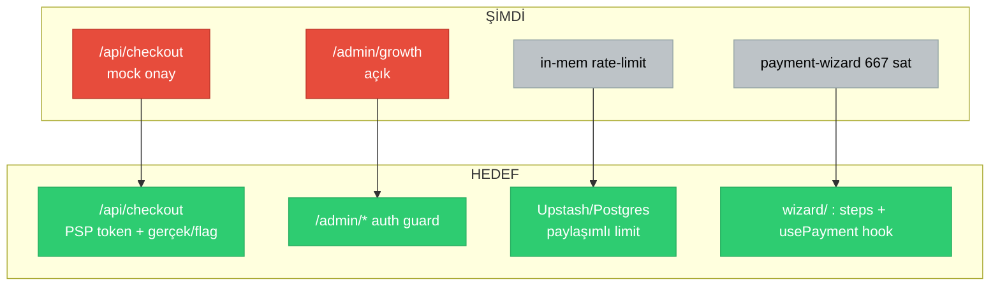
*Ne gösterir: yalnızca değişen düğümler. Dikkat: D1 ile tutarlı — aynı modül adları; dört Critical/High yüzey hedef-durumda yeşile dönüyor. Evidence: D1, F1/F2/F3/F4.*

---

## 5. Task Plan

Her Critical/High bulgu ≥1 task'a bağlı (izlenebilirlik sütunu).

| ID | Başlık | Etkilenen | Kabul kriteri | Efor | Risk | Bağ. | Çözer |
|----|--------|-----------|---------------|------|------|------|-------|
| **T1** | `/odeme` mock'unu netleştir veya devre dışı bırak | `checkout/route.ts`, `payment-wizard.tsx`, `/odeme` | UI'da "DEMO — tahsilat yok" net uyarı **veya** route 503 + WhatsApp yönlendirme; "Ödeme onaylandı" metni kaldırıldı | S | Düşük | — | F1 |
| **T2** | `/admin/*` auth guard | `app/admin/growth/page.tsx`, `middleware.ts` veya layout | Auth'suz istek `/admin/growth`'a 302/401; Payload oturumu zorunlu | M | Orta | — | F2 |
| **T3** | CI pipeline (GitHub Actions) | `.github/workflows/ci.yml` (yeni) | PR'da build+lint+vitest+playwright; biri kırılırsa merge bloke | M | Düşük | — | F5 |
| **T4** | Paylaşımlı rate-limit/replay store | `lib/security.ts`, `ai/security.ts`, `webhook/*` | Upstash Redis (veya Postgres) adapteri; in-mem fallback yalnız dev | L | Orta | T3 | F3 |
| **T5** | B2B availability: tamamla veya kaldır | `api/v1/availability/route.ts`, `lib/ecc-auth.ts` | Public key env/DB'den; ya da endpoint + mock PK kaldırıldı | M | Orta | — | F6 |
| **T6** | Ölü kod & mock temizliği | `swarm/route.ts`, `HotelRunnerEvents.ts`, `remotion/*`, `graphql` | Kullanılmayan collection/route/paket kaldırıldı; `npm ls` temiz; build EXIT:0 | M | Orta | T3 | F7,F8 |
| **T7** | `payment-wizard.tsx` böl | `components/payment-wizard/*` (yeni) | < 350 sat ana dosya; adımlar ayrı + `usePaymentWizard` hook; e2e yeşil | L | Orta | T3 | F4 |
| **T8** | `experience-designer-client.tsx` böl | `components/experience-designer/*` | < 350 sat; saf fonksiyonlar test edilir | L | Orta | T3 | F4 |
| **T9** | `home-client.tsx` böl | `components/home/sections/*` | Her section ayrı dosya; ana dosya orkestratör | M | Düşük | T3 | F4 |
| **T10** | `as any` cast'lerini tiple | `checkout/route.ts`, `lead/route.ts` | Payload generated tipleri; `any` yok; tsc temiz | S | Düşük | — | F11 |
| **T11** | Yapılandırılmış log + PII maskeleme | `lib/` (yeni `logger.ts`), route'lar | JSON log; IP/isim maskeli; `console.*` route'lardan kalktı | M | Düşük | — | F12 |
| **T12** | Duplike monkey testi birleştir | `tests/monkey*.spec.ts` | Tek dosya; diğeri silindi; playwright yeşil | S | Düşük | — | F10 |
| **T13** | Deploy hedefini tekleştir + README | `railway.json`, `README.md` | Tek hedef belgeli; mock ödeme + env tablosu doğru | S | Düşük | — | F9,F16,F14 |
| **T14** | `middleware.ts`: işlev ver veya kaldır | `middleware.ts` | Ya gerçek geo/i18n rewrite ya matcher kaldırıldı | S | Düşük | — | F15 |
| **T15** | PAN'ı sunucudan çıkar (PSP token) | `checkout/route.ts`, `payment-wizard.tsx` | Sunucuya ham kart numarası gelmiyor; PSP token alanı | L | Yüksek | T1 | F13 |

### D10 — Task Dependency DAG

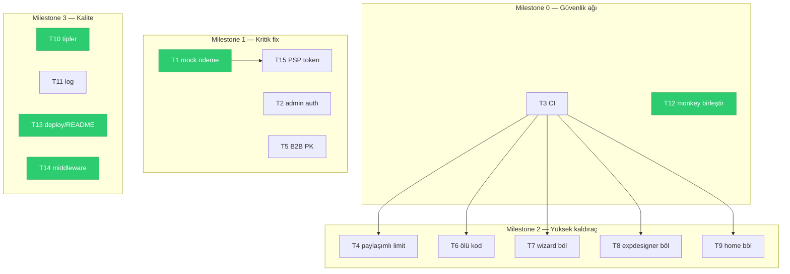
*Ne gösterir: milestone'lara göre task DAG; yeşiller quick-win. Dikkat: kritik yol T3 → (T4/T6/T7/T8/T9) — CI önce gelmeli ki bölme işleri güvenle yapılsın. T1 ve T2 bağımsız, hemen yapılabilir. Evidence: T1–T15 tablosu.*

### D11 — Milestone Timeline

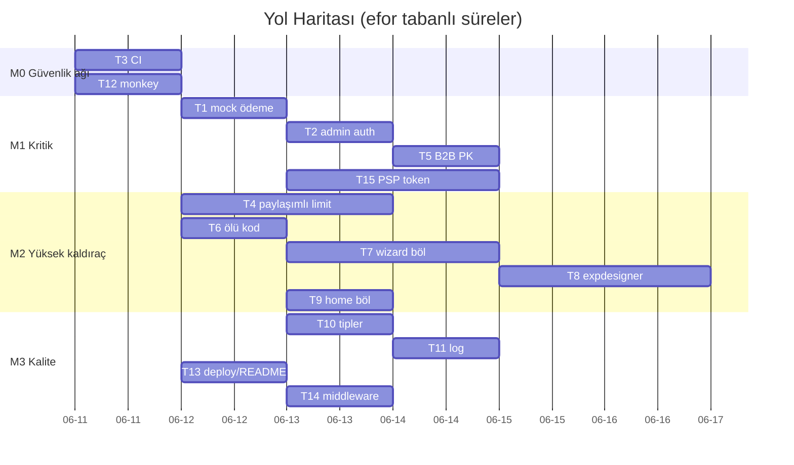
*Ne gösterir: milestone'lar + efor süreleri + bağımlılık. Dikkat: M0+M1 ~1 hafta içinde tüm Critical'ları kapatır; M2 refactor'lar CI'dan (T3) sonra paralel.*

### D12 — Quick-Win Quadrant

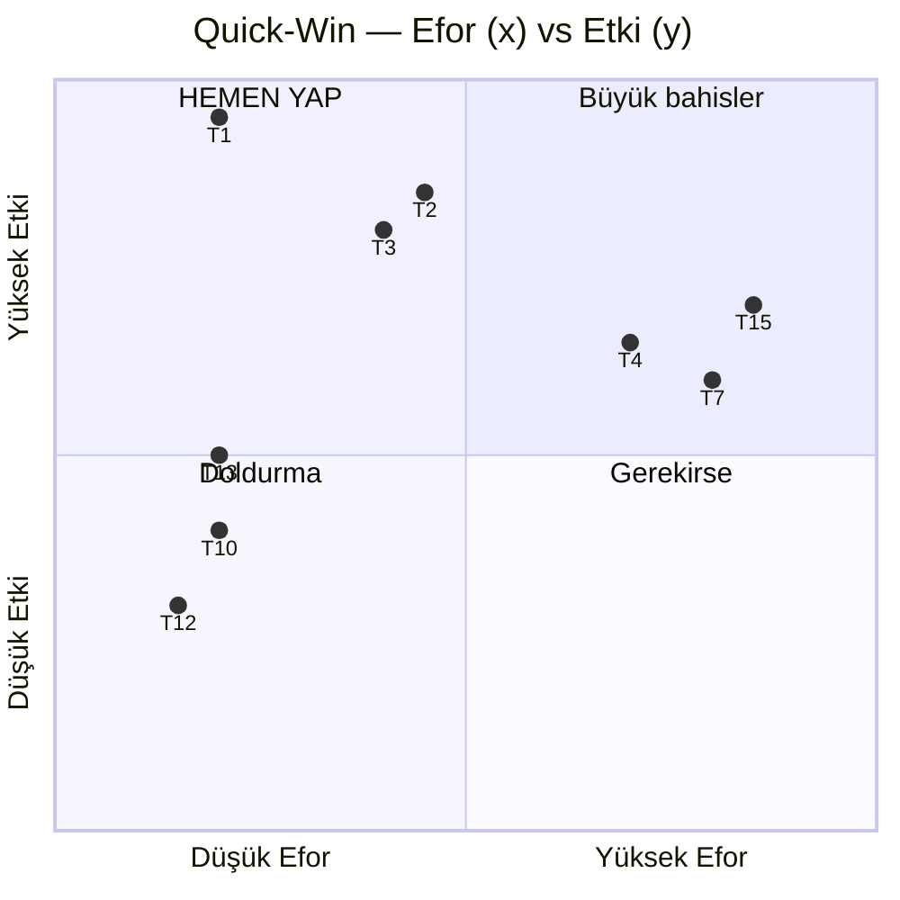
*Ne gösterir: tüm task'ların efor×etki konumu. Dikkat: sol-üst ("hemen yap") = **T1, T3, T13** — düşük efor, yüksek etki. T1 (mock ödeme uyarısı) en yüksek getirili tek hamle.*

### Quick Wins (hemen)
- **T1** (S) — mock ödeme uyarısı/devre dışı: en yüksek risk, en düşük efor.
- **T3** (M) — CI gate: tüm gelecek işi güvene alır.
- **T12, T10, T13, T14** (S) — temizlik; bir oturumda toplanabilir.

### Top-3 implementation sketch

**T1 — Mock ödeme (Critical, S).** Yaklaşım: `payment-wizard.tsx`'te submit'ten önce belirgin "Bu bir DEMO ödemesidir, kart çekilmez" bandı; başarı ekranındaki "Ödeme onaylandı" → "Rezervasyon talebiniz alındı, teyit için sizi arayacağız". Sunucuda `checkout/route.ts:79` mock kabulü koru ama yanıt mesajını "talep kaydedildi"ye çevir (tahsilat iddiası kalksın). Gotcha: e2e "WhatsApp linki görünür" testini bozma; `data-event` izleme adlarını koru.

**T2 — Admin auth (Critical, M).** Yaklaşım: `/admin/growth`'u Payload oturumuna bağla — server component'e çevirip `getPayloadClient().auth()` ile `req` cookie kontrolü, yoksa `redirect('/admin/login')`. Alternatif: `middleware.ts` matcher'ına `/admin/growth` ekleyip oturum cookie yoksa 302. Gotcha: Payload'ın kendi `/admin` paneliyle çakışma; sadece custom `growth` alt-rotasını koru.

**T3 — CI (High, M).** Yaklaşım: `.github/workflows/ci.yml`: Node 20, `npm ci`, `npm run lint`, `npx vitest run --project unit`, `npx playwright install --with-deps chromium`, `npm run build`, `npx playwright test`. Gotcha: Playwright webServer prod build ister → adım sırası build→test; DATABASE_URI olmadan Payload build'inin env guard'ı (`lib/env.ts:31` `isBuild`) zaten geçişe izin veriyor, bunu CI'da doğrula.

---

## 6. Visual Atlas

| ID | Başlık | Bölüm |
|----|--------|-------|
| D1 | Architecture Graph | Repo Map |
| D2 | Primary Data Flow (checkout) | Repo Map |
| D3 | Repo Topology | Repo Map |
| D4 | Coupling & Hotspot Graph | Audit Report |
| D5 | Findings by Severity (pie) | Executive Summary |
| D6 | Risk Matrix (quadrant) | Executive Summary |
| D7 | Security Surface Map | Audit Report |
| D8 | Theme Map (mindmap) | Strategy |
| D9 | Target Architecture Before→After | Strategy |
| D10 | Task Dependency DAG | Task Plan |
| D11 | Milestone Timeline (gantt) | Task Plan |
| D12 | Quick-Win Quadrant | Task Plan |

---

## 7. Open Questions (insan kararı gerekli)

1. **Ödeme:** `/odeme` gerçek bir PSP'ye mi bağlanacak (iyzico webhook'u zaten var) yoksa kalıcı olarak WhatsApp/HMS'e mi yönlendirilecek? T1 vs T15 kararını bu belirler.
2. **B2B availability** (`/api/v1/availability`): Gerçek bir partner entegrasyonu planı var mı, yoksa kaldırılsın mı? (F6/T5)
3. **`/admin/growth`** paneli: İç ekip için gerçek bir araç mı olacak (o zaman gerçek veri + auth), yoksa demo mu? Demo ise prod'da tamamen kapatılmalı.
4. **Remotion:** Video render pipeline'ı kullanılacak mı? Değilse T6 ile kaldırılır (~3 paket).
5. **Deploy:** Vercel mi Railway mi? `railway.json` kalsın mı? (F9/T13)
6. **Performans hedefi:** Belirli bir Lighthouse/LCP hedefi var mı? Şu an ölçüt yok; varsa M2'ye perf task'ı eklenir.

---
*Bu rapor analiz amaçlıdır; hiçbir kaynak dosya değiştirilmedi. Çekirdek %20 (api + lib/security + checkout + payment-wizard) derinlemesine; remotion/agent/trigger yüzeysel incelendi.*
